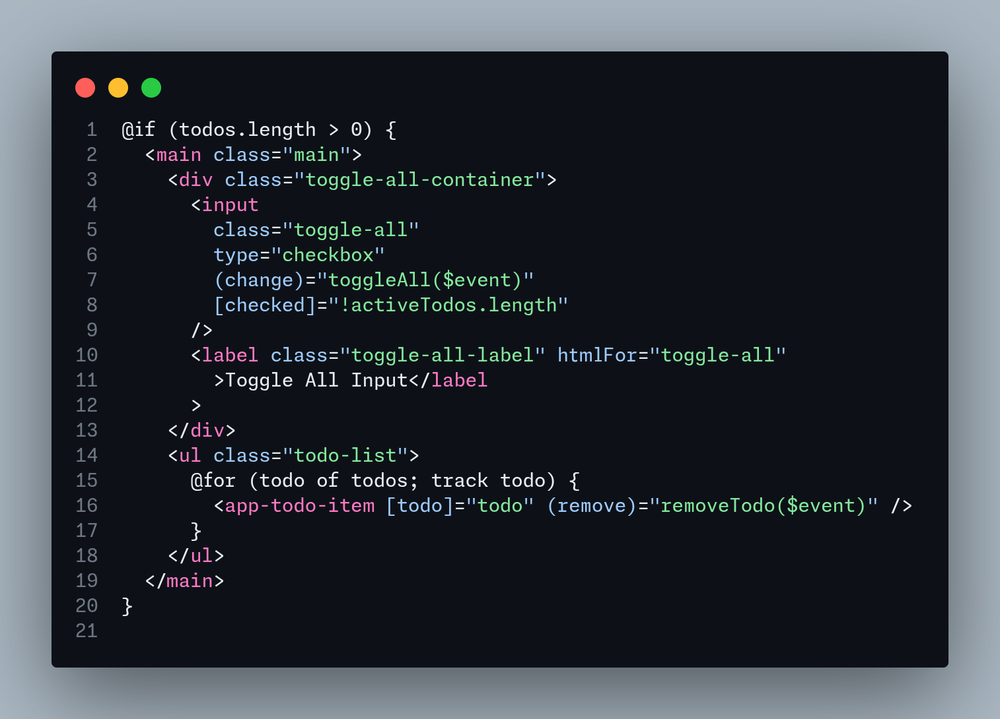
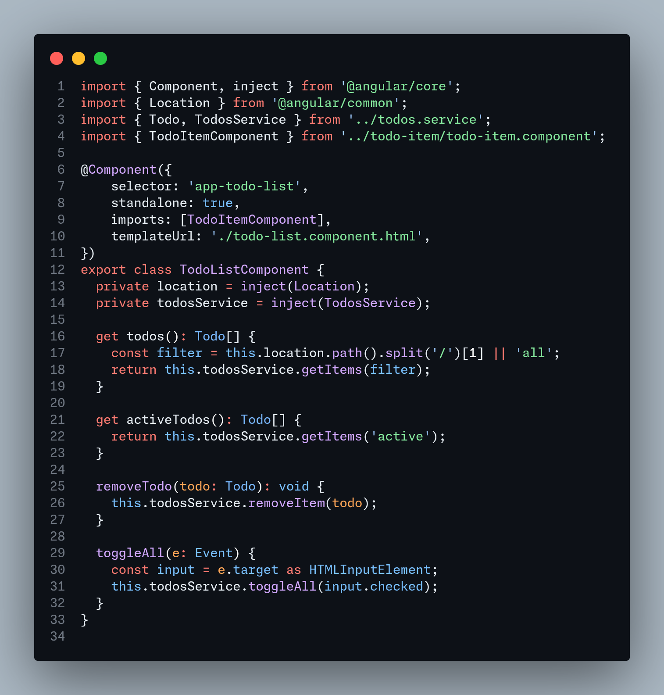
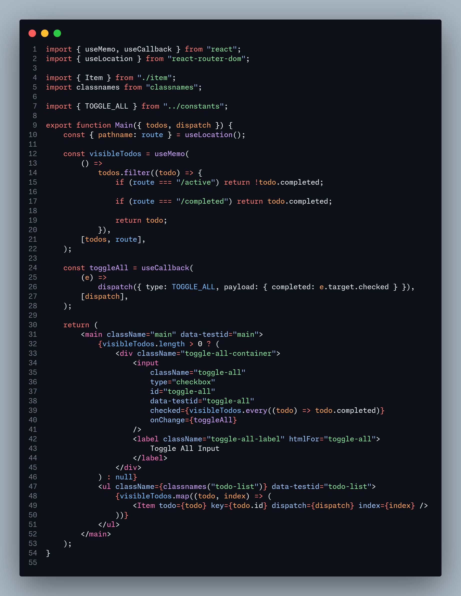
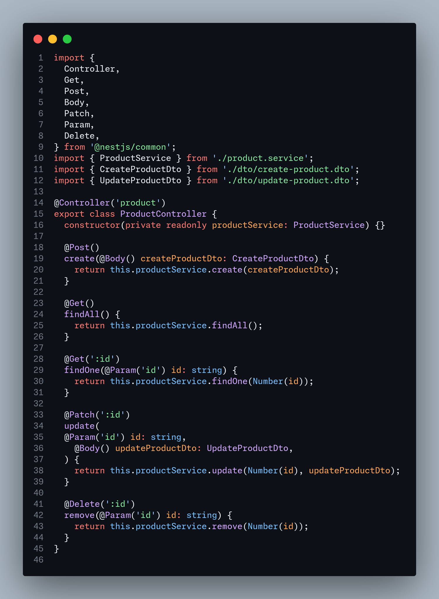
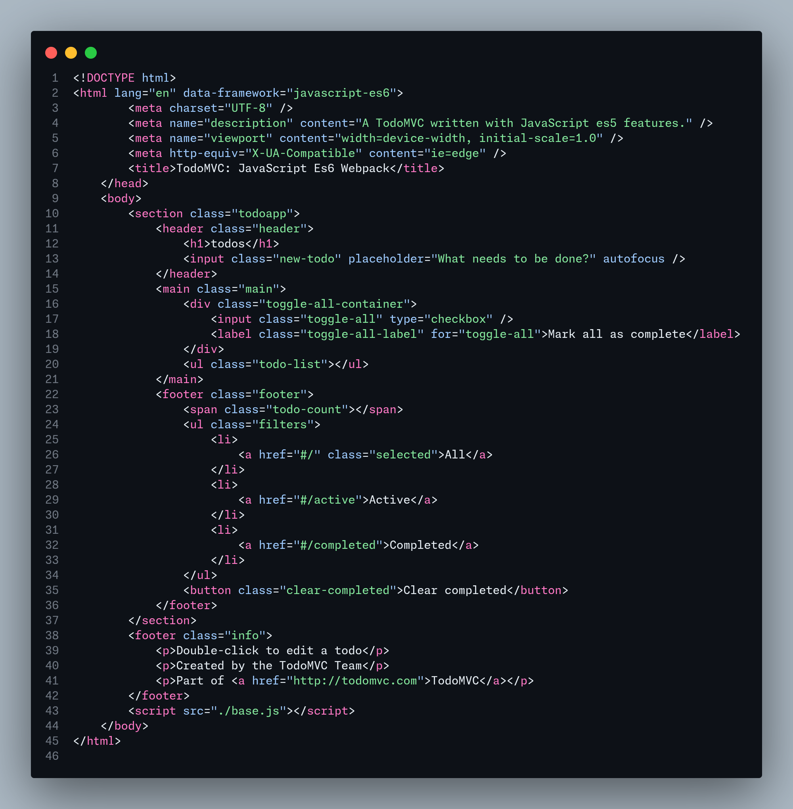
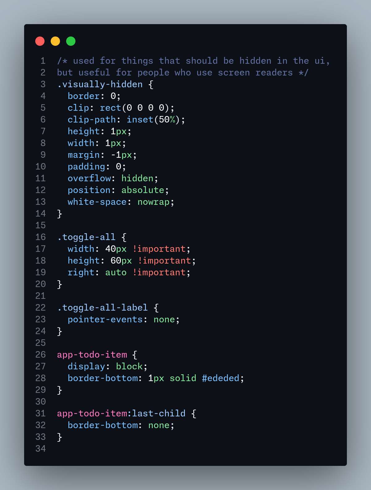

# GitHub Dark Inspired Theme

A clean, polished dark theme for VS Code inspired by the original GitHub dark theme, but refined for daily coding.

The Theme extension is available in [Visual Studio Marketplace](https://marketplace.visualstudio.com/items?itemName=igolskyi-vsc.vscode-github-dark-inspired-theme) and [Open VSX Registry](https://open-vsx.org/extension/igolskyi/vscode-github-dark-inspired-theme)

## Install

1. Open the **Extensions** view in VS Code (`Ctrl+Shift+X`).
2. Search for `GitHub Dark Inspired`.
3. Click **Install**.
4. Go to **File > Preferences > Theme > Color Theme** and select `GitHub Dark Inspired`.

## Screenshots

### Angular




### React



### NestJS



### HTML & CSS





## Customization

You can further customize this theme in your VS Code `settings.json`:

```json
"workbench.colorCustomizations": {
    "editor.background": "#0d1117",
    "activityBar.background": "#010409"
}
```

## License

MIT License - see [LICENSE.txt](LICENSE.txt) for details.

## Changelog

See [CHANGELOG.md]()

